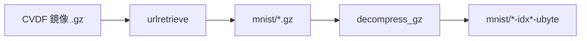
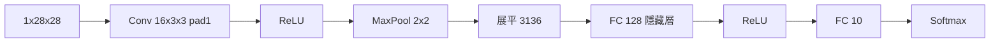
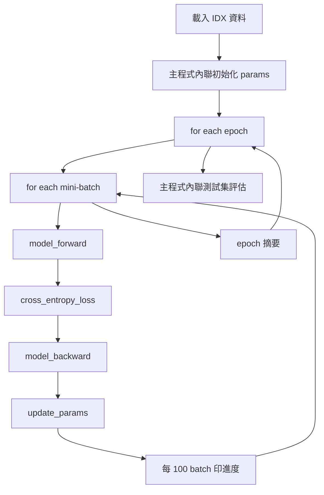
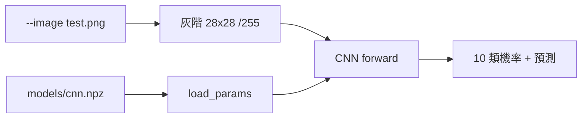

# mnist-playground

以 Python 逐步探索 MNIST 手寫數字資料集：下載原始資料、匯出 PNG 圖片、以純 NumPy 訓練 MLP 與 CNN 辨識模型，並對自訂圖片做推理。

## 環境需求

- Python 3.9 以上（需支援 `str.removesuffix`）
- [Miniconda](https://docs.anaconda.com/miniconda/)（建議）或已安裝的 Python 3

## 使用 Miniconda 建立環境

以下指令假設你已安裝 Miniconda，並在專案根目錄執行。

### 1. 建立並啟用 Conda 環境

```bash
conda create -n mnist-playground python=3.12 -y
conda activate mnist-playground
```

### 2. 安裝相依套件

```bash
pip install -r requirements.txt
```

### 3. 執行步驟腳本

依序執行各步驟（後續步驟依賴前一步產出的資料）：

```bash
# 步驟 1：下載並解壓 MNIST 原始檔至 mnist/
python step_1_download_mnist.py

# 步驟 2：將全部圖片匯出至 images/（依 train/test 與標籤分類）
python step_2_show_image.py

# 步驟 3a：以純 NumPy 淺層 MLP 訓練（784→128→10，建議先跑）
python step_3_train_mlp.py

# 步驟 3b：以純 NumPy CNN 訓練（僅需 step 1 的 mnist/ 資料）
python step_3_train_cnn.py

# 步驟 4a：以 MLP 對圖片推理（預設 test.png，需先跑 step 3a）
python step_4_inference_mlp.py
python step_4_inference_mlp.py --image images/test/4/00027.png

# 步驟 4b：以 CNN 對圖片推理（預設 test.png，需先跑 step 3b）
python step_4_inference_cnn.py
python step_4_inference_cnn.py --image test.png
```

### 4. 離開環境（選用）

```bash
conda deactivate
```

## 專案結構說明

| 路徑 | 說明 |
|------|------|
| `mnist/` | MNIST IDX 原始檔（由 step 1 產生，已加入 `.gitignore`） |
| `images/` | 匯出的 PNG 圖片（由 step 2 產生，已加入 `.gitignore`） |
| `models/` | 訓練權重 `.npz`（由 step 3 產生，已加入 `.gitignore`） |
| `step_1_download_mnist.py` | 從官方鏡像下載並解壓資料集 |
| `step_2_show_image.py` | 解析 IDX 格式並輸出 PNG |
| `step_3_train_mlp.py` | 純 NumPy 淺層 MLP（784→128→10），訓練 MNIST 分類模型 |
| `step_3_train_cnn.py` | 純 NumPy 手寫 CNN，訓練 MNIST 分類模型 |
| `step_4_inference_mlp.py` | 載入 MLP 權重，對 PNG 圖片推理並輸出 10 類機率 |
| `step_4_inference_cnn.py` | 載入 CNN 權重，對 PNG 圖片推理並輸出 10 類機率 |
| `AGENTS.md` | AI 代理修改本專案時應遵循的規則 |

## 相依套件

| 套件 | 用途 |
|------|------|
| Pillow | 將 MNIST 像素資料寫入 PNG（step 2）；讀取推理輸入圖片（step 4） |
| NumPy | 矩陣運算與純 NumPy 模型訓練、推理（step 3、step 4） |

`step_1_download_mnist.py` 僅使用 Python 標準函式庫，無需額外安裝套件。

## 程式碼說明

以下為專案中每個 `*.py` 腳本的詳細說明。新增腳本時必須在此章節補上對應小節（見 [`AGENTS.md`](AGENTS.md)）。

| 腳本 | 小節 |
|------|------|
| `step_1_download_mnist.py` | [step 1](#step_1_download_mnistpy) |
| `step_2_show_image.py` | [step 2](#step_2_show_imagepy) |
| `step_3_train_mlp.py` | [step 3a 淺層 MLP](#step_3_train_mlppy) |
| `step_3_train_cnn.py` | [step 3b CNN](#step_3_train_cnnpy) |
| `step_4_inference_mlp.py` | [step 4a MLP 推理](#step_4_inference_mlppy) |
| `step_4_inference_cnn.py` | [step 4b CNN 推理](#step_4_inference_cnnpy) |

### step_1_download_mnist.py

從 [Google CVDF 鏡像](https://storage.googleapis.com/cvdf-datasets/mnist/) 下載 4 個 `.gz` 壓縮檔，解壓至 `mnist/` 目錄，供 step 2 讀取。

**下載清單**

| 壓縮檔 | 解壓後 | 內容 |
|--------|--------|------|
| `train-images-idx3-ubyte.gz` | `train-images-idx3-ubyte` | 訓練集圖像（60000 張） |
| `train-labels-idx1-ubyte.gz` | `train-labels-idx1-ubyte` | 訓練集標籤 |
| `t10k-images-idx3-ubyte.gz` | `t10k-images-idx3-ubyte` | 測試集圖像（10000 張） |
| `t10k-labels-idx1-ubyte.gz` | `t10k-labels-idx1-ubyte` | 測試集標籤 |

**執行流程**

1. `os.makedirs("mnist")` 建立輸出目錄
2. `urllib.request.urlretrieve` 下載至 `mnist/{file}`
3. `decompress_gz` 以 `gzip.open` 讀取、`shutil.copyfileobj` 寫出原始 IDX 二進位檔
4. 輸出路徑以 `removesuffix(".gz")` 去掉副檔名



僅使用 Python 標準函式庫（`gzip`、`os`、`shutil`、`urllib.request`），無需額外安裝套件。

#### `decompress_gz` 原理

```python
def decompress_gz(gz_path: str, out_path: str) -> None:
    with gzip.open(gz_path, "rb") as f_in, open(out_path, "wb") as f_out:
        shutil.copyfileobj(f_in, f_out)
```

| 步驟 | 說明 |
|------|------|
| `gzip.open(..., "rb")` | 以二進位模式讀取 `.gz` 壓縮檔 |
| `open(out_path, "wb")` | 建立解壓後的輸出檔（同為二進位） |
| `shutil.copyfileobj` | 把解壓後的位元組串流複製到輸出檔，不需一次載入整個檔案到記憶體 |

主迴圈對 `FILES` 清單中 4 個檔案各執行一次：`urlretrieve` 下載 → `decompress_gz` 解壓 → 以 `removesuffix(".gz")` 決定輸出路徑。

**預期輸出範例**

```
=== MNIST Download ===
[1/4] train-images-idx3-ubyte.gz
      Downloading ...
      Saved to mnist/train-images-idx3-ubyte.gz
      Decompressing ...
      Output → mnist/train-images-idx3-ubyte
[2/4] train-labels-idx1-ubyte.gz
      Downloading ...
      Saved to mnist/train-labels-idx1-ubyte.gz
      Decompressing ...
      Output → mnist/train-labels-idx1-ubyte
...
[4/4] t10k-labels-idx1-ubyte.gz
      Downloading ...
      Saved to mnist/t10k-labels-idx1-ubyte.gz
      Decompressing ...
      Output → mnist/t10k-labels-idx1-ubyte
      All 4 IDX files ready in mnist/
```

#### 設計要點

1. **官方鏡像**：使用 Google CVDF 託管的 MNIST 鏡像，避免原始網站連線不穩。
2. **保留 `.gz` 與解壓檔**：下載的壓縮檔與解壓後的 IDX 檔皆留在 `mnist/`，方便 step 2／step 3 直接讀取。
3. **無第三方依賴**：只用標準函式庫，降低環境設定門檻。

### step_2_show_image.py

讀取 `mnist/` 下的 IDX 原始檔，將每張 28×28 灰階圖匯出為 PNG，依 `train`/`test` 分割與數字標籤（0–9）分類存放。

**整體流程**

1. 檢查 `mnist/` 下 4 個 IDX 檔是否存在，缺檔則提示先執行 step 1
2. 對 `train` / `test` 各呼叫 `export_split`：讀圖 + 讀標籤 → 逐張寫入 `images/{split}/{label}/{index:05d}.png`

#### 背景：MNIST IDX 格式

MNIST 原始資料不是 PNG，而是 Yann LeCun 定義的 **IDX 格式**：

| 檔案類型 | 後綴 | Magic Number | 維度 |
|---------|------|--------------|------|
| 圖像 | `idx3-ubyte` | **2051** | 3 維（張數 × 高 × 寬） |
| 標籤 | `idx1-ubyte` | **2049** | 1 維（筆數） |

檔案結構：**固定長度的檔頭（header）** + **連續的原始位元組（payload）**。

#### `read_images` 原理

```python
def read_images(path: str) -> tuple[bytes, int, int, int]:
    """讀取 IDX3 圖像檔，回傳像素位元組、張數、列數、行數。"""
    with open(path, "rb") as f:
        # 大端序：magic(2051)、張數、列數、行數
        magic, count, rows, cols = struct.unpack(">IIII", f.read(16))
        if magic != 2051:
            raise ValueError(f"unexpected magic number in {path}: {magic}")
        return f.read(count * rows * cols), count, rows, cols
```

**1. 以二進位模式開檔**

`"rb"` 表示不經文字解碼，直接讀原始位元組。

**2. 解析 16 位元組檔頭**

`struct.unpack(">IIII", f.read(16))` 把前 16 個位元組拆成 4 個 **32 位元無符號整數**：

| 欄位 | 位元組偏移 | 含義 |
|------|-----------|------|
| magic | 0–3 | 格式識別碼，圖像檔應為 **2051** |
| count | 4–7 | 圖片張數（訓練集 60000，測試集 10000） |
| rows | 8–11 | 每張圖高度（MNIST 為 **28**） |
| cols | 12–15 | 每張圖寬度（MNIST 為 **28**） |

- `>`：大端序（高位元組在前），符合 IDX 規範
- `I`：unsigned int，4 位元組
- 4 個 `I` → 共 16 位元組

**3. 驗證 magic number**

`2051` 代表「3 維 unsigned byte 資料集」，用來確認檔案類型正確。

**4. 一次讀入全部像素**

```python
f.read(count * rows * cols)
```

檔頭之後是 **連續排列** 的像素：每張 28×28 = 784 位元組，灰階值 0–255（0 黑、255 白）。

記憶體布局示意：

```
[圖0: 784 bytes][圖1: 784 bytes][圖2: 784 bytes]...
 ↑ i=0          ↑ i=1          ↑ i=2
```

回傳 `(pixels, count, rows, cols)`，後續用索引切片取第 i 張：

```python
img_bytes = pixels[i * pixel_size : (i + 1) * pixel_size]
```

#### `read_labels` 原理

```python
def read_labels(path: str) -> tuple[bytes, int]:
    """讀取 IDX1 標籤檔，回傳標籤位元組與筆數。"""
    with open(path, "rb") as f:
        # 大端序：magic(2049)、筆數
        magic, count = struct.unpack(">II", f.read(8))
        if magic != 2049:
            raise ValueError(f"unexpected magic number in {path}: {magic}")
        return f.read(count), count
```

**1. 8 位元組檔頭**

| 欄位 | 位元組偏移 | 含義 |
|------|-----------|------|
| magic | 0–3 | 標籤檔應為 **2049**（1 維 unsigned byte） |
| count | 4–7 | 標籤筆數，應與圖像張數相同 |

`">II"` → 2 個 unsigned int，共 8 位元組。

**2. 讀取標籤 payload**

`f.read(count)` 讀取 **count 個位元組**，每個位元組是一個數字標籤 **0–9**。

```
labels[0]=5, labels[1]=0, labels[2]=4, ...
```

Python 的 `bytes` 索引得到的是 **0–255 的 int**，對 MNIST 標籤即 0–9。

#### 兩者如何對應

在 `export_split` 裡：

```python
pixels, count, rows, cols = read_images(f"{MNIST_DIR}/{images_file}")
labels, label_count = read_labels(f"{MNIST_DIR}/{labels_file}")
if count != label_count:
    raise ValueError(
        f"mismatch in {split}: {count} images vs {label_count} labels"
    )

pixel_size = rows * cols
for i in range(count):
    label = labels[i]
```

同一索引 `i` 表示同一筆樣本：第 `i` 張圖的 784 位元組，對應第 `i` 個標籤位元組。MNIST 保證圖像檔與標籤檔 **順序一致**。

#### 檔案整體結構示意

```
train-images-idx3-ubyte
┌─────────────────────────────────────┐
│ Header (16 bytes)                   │
│  magic=2051 | count=60000           │
│  rows=28    | cols=28               │
├─────────────────────────────────────┤
│ Pixel data (60000 × 28 × 28 bytes)  │
│  [img0][img1][img2]...[img59999]    │
└─────────────────────────────────────┘

train-labels-idx1-ubyte
┌─────────────────────────────────────┐
│ Header (8 bytes)                    │
│  magic=2049 | count=60000           │
├─────────────────────────────────────┤
│ Label data (60000 bytes)            │
│  [5][0][4][1]...[9]  每個 0-9       │
└─────────────────────────────────────┘
```

#### `export_split` 與 PNG 輸出

- 比對圖像張數與標籤筆數，不一致則拋錯
- `Image.frombytes("L", (cols, rows), img_bytes)`：`"L"` 表示 8 位元灰階，將一維位元組還原為 28×28 影像
- 輸出目錄結構：`images/train/3/00042.png`（分割 / 標籤 / 原始索引）

`Image.frombytes("L", (cols, rows), img_bytes)` 會把 784 位元組的一維資料，依 `(cols, rows)` 即 `(28, 28)` 逐列填入，還原成灰階圖像後再存成 PNG。

**預期輸出範例**

```
=== MNIST PNG Export ===
[1/3] Checking MNIST files ...
      All 4 IDX files found
[2/3] Exporting train split ...
      Images: 60000 samples, 28×28
      Labels: 60000 labels matched
      Output → images/train/{0-9}/
      Export complete: 60000 images
[3/3] Exporting test split ...
      Images: 10000 samples, 28×28
      Labels: 10000 labels matched
      Output → images/test/{0-9}/
      Export complete: 10000 images
```

#### 設計要點

1. **`struct.unpack`**：把二進位檔頭按固定格式解析成 Python 整數，避免手動移位。
2. **大端序 `>`**：與 IDX 規範一致；若用小端序會讀錯 magic 和維度。
3. **一次讀入 payload**：`f.read(n)` 簡單高效；60000×784 ≈ 47MB，可接受。
4. **回傳 `bytes` 而非逐張解析**：切片 `pixels[i*784:(i+1)*784]` 即可，延後交給 PIL 的 `Image.frombytes("L", (28, 28), ...)` 轉成 PNG。

### step_3_train_mlp.py

直接讀取 `mnist/` 下的 IDX 原始檔，以 **純 NumPy** 手寫全連接神經網路（MLP），訓練 MNIST 手寫數字辨識模型。不含卷積與池化，適合先理解反向傳播與 mini-batch 訓練，再進階到 [`step_3_train_cnn.py`](#step_3_train_cnnpy)。

**前置條件**：執行 step 1 下載資料；**不需要** step 2 的 PNG 圖片。

**網路架構**


| 層 | 輸出形狀 | 說明 |
|----|---------|------|
| 展平 | 784 | 28×28 灰階像素排成一根向量 |
| FC hidden + ReLU | 128 | 唯一的全連接隱藏層 |
| FC output + Softmax | 10 | 輸出 0～9 各類別機率 |

**預設超參數**：100 epoch、batch size 64、學習率 0.01、SGD 優化器。全量 60000 筆訓練後，測試集準確率約 92～94%（略低於 CNN，因未提取局部空間特徵）。

**執行流程**

1. 檢查 `mnist/` 下 4 個 IDX 檔是否存在
2. 載入訓練集與測試集，像素正規化至 [0, 1]，標籤轉 one-hot
3. 主程式內聯建立 `fc1`（784→128）與 `fc2`（128→10）權重字典
4. 逐 epoch、逐 mini-batch 執行 `model_forward` → 交叉熵損失 → `model_backward` → `update_params`
5. 每 epoch 結束印摘要；主程式內聯分批評估測試集準確率

**預期輸出範例**

```
=== MLP Training ===
[1/5] Loading MNIST data ...
      train: 60000 samples
      test:  10000 samples
      shape: (60000, 1, 28, 28), normalized [0, 1]
[2/5] Initializing model ...
      fc1 W: (784, 128)  fc2 W: (128, 10)
[3/5] Training ...
      100 epochs, batch_size=64, 938 batches/epoch, lr=0.01
      epoch 1/100  batch 100/938  loss=0.6200  avg_loss=0.7800  train_acc=78.5%
      ...
      epoch 1/100 done  loss=0.4500  train_acc=87.5%
      ...
[4/5] Evaluating on test set ...
      eval batch 40/40  running_acc=93.1%
      test accuracy: 93.1%
[5/5] Saving weights ...
      Saved to models/mlp.npz
```

#### 與 CNN 版的對照

| 項目 | 淺層 MLP（本腳本） | CNN（`step_3_train_cnn.py`） |
|------|-------------------|------------------------------|
| 輸入處理 | 直接展平 784 維 | 保留 (1, 28, 28) 空間結構 |
| 特徵提取 | 無，靠全連接學全局模式 | Conv + MaxPool 提取局部筆畫特徵 |
| 隱藏層 | FC(128) | Conv(16, pad=1) + FC(128) |
| 程式複雜度 | 較低，無 im2col／卷積 | 較高，含卷積與池化 |
| 測試準確率 | 約 92～94% | 約 97～98% |

#### 關鍵函式原理

**`model_forward`／`model_backward`**

```python
def model_forward(x, params):
    flat = x.reshape(x.shape[0], -1)           # (batch, 784)
    f1 = dense_forward(flat, params["fc1"])  # (batch, 128)
    r1 = relu(f1)
    logits = dense_forward(r1, params["fc2"]) # (batch, 10)
    return softmax(logits), cache

def model_backward(probs, y_true, params, cache):
    dout = cross_entropy_gradient(probs, y_true)
    dout = dense_backward(dout, params["fc2"], cache["r1"])
    dout = relu_backward(cache["f1"], dout)
    dense_backward(dout, params["fc1"], cache["flat"])
```

反向傳播只有兩層全連接 + 一個 ReLU，是理解鏈式法則最簡單的起點。學會後再讀 CNN 版，只需額外理解卷積與池化的 forward／backward。

#### 設計要點

1. **先 MLP 後 CNN**：把 784 個像素直接當特徵，讓讀者專注於梯度下降與反向傳播，不被卷積細節分散注意力。
2. **純函式 + 字典**：與 CNN 版相同風格，`params["fc1"]["W"]` 存放隱藏層權重。
3. **單檔自包含**：資料讀取、激活函式、訓練迴圈全在同一檔案，方便對照 README 學習。

### step_3_train_cnn.py

直接讀取 `mnist/` 下的 IDX 原始檔，以 **純 NumPy** 從頭實作卷積神經網路（CNN），訓練 MNIST 手寫數字辨識模型。不依賴 PyTorch、TensorFlow 等深度學習框架，且 **全程以純函式實作，不使用 class**；權重與梯度存放在 `params` 字典，中間結果存放在 `cache` 字典。

**前置條件**：執行 step 1 下載資料；**不需要** step 2 的 PNG 圖片。

**網路架構**



| 層 | 輸出形狀 | 說明 |
|----|---------|------|
| Conv1 + ReLU | 16×28×28 | 16 個 3×3 卷積核，padding=1 保留邊界筆畫 |
| MaxPool1 | 16×14×14 | 2×2 窗口取最大值，縮小特徵圖 |
| FC hidden + ReLU | 128 | 唯一的全連接隱藏層，輸入 16×14×14=3136 維 |
| FC output + Softmax | 10 | 輸出 0～9 各類別機率 |

**預設超參數**：5 epoch、batch size 64、學習率 0.01（第 4 epoch 起 ×0.5）、Momentum 0.9。像素正規化至 [0, 1] 並減 MNIST 均值 0.1307。全量 60000 筆訓練後，測試集準確率約 97～98%。

**執行流程**

1. 檢查 `mnist/` 下 4 個 IDX 檔是否存在
2. 載入訓練集與測試集，像素正規化至 [0, 1] 並減 MNIST 均值，標籤轉 one-hot
3. 主程式內聯建立各層權重字典（`init_conv_params` + `init_dense_params`）與 Momentum 速度字典
4. 逐 epoch、逐 mini-batch 執行 `model_forward` → 交叉熵損失 → `model_backward` → `update_params`；每 100 個 batch 印一次進度
5. 每 epoch 結束印摘要；主程式內聯分批評估測試集準確率

**預期輸出範例**

```
=== CNN Training ===
[1/5] Loading MNIST data ...
      train: 60000 samples
      test:  10000 samples
      shape: (60000, 1, 28, 28), normalized [0, 1] minus mean 0.1307
[2/5] Initializing model ...
      conv1 W: (16, 1, 3, 3)  fc1 W: (3136, 128)  fc2 W: (128, 10)
[3/5] Training ...
      5 epochs, batch_size=64, 938 batches/epoch, lr=0.01, momentum=0.9
      epoch 1/5  batch 100/938  loss=0.4800  avg_loss=0.6200  train_acc=83.5%
      epoch 1/5  batch 200/938  loss=0.3500  avg_loss=0.4900  train_acc=86.8%
      ...
      epoch 1/5 done  loss=0.3800  train_acc=89.2%
      ...
      epoch 4/5  lr=0.005
      ...
[4/5] Evaluating on test set ...
      eval batch 40/40  running_acc=97.4%
      test accuracy: 97.4%
[5/5] Saving weights ...
      Saved to models/cnn.npz
```

#### 背景：什麼是 CNN？

**卷積神經網路（CNN）** 是一種專門處理圖像的深度學習模型。與「把 784 個像素直接丟進全連接層」不同，CNN 利用兩個關鍵想法：

| 概念 | 白話說明 |
|------|---------|
| 卷積（Convolution） | 用多個小濾鏡（例如 3×3）在圖上滑動，逐格做加權求和，提取邊緣、筆畫等局部特徵 |
| 池化（Pooling） | 把鄰近區域壓縮成一個值（本專案取最大值），縮小特徵圖、減少計算量 |
| 全連接（Dense） | 把特徵圖展平成向量，做最終的分類決策 |
| 反向傳播（Backpropagation） | 從預測誤差往回算，告訴每一層的權重該往哪個方向調整 |

本專案用 **純 NumPy** 手寫上述全部邏輯，不依賴 PyTorch 等框架的自動求導。

#### 檔案結構（區塊分段）

`step_3_train_cnn.py` 以 `# === 區塊標題 ===` 分成 8 段，建議由上而下閱讀：

```
設定常數 → IDX 資料讀取 → im2col 輔助 → 激活與損失 → 參數初始化 helper → 卷積／池化／全連接函式 → 模型前向／反向／更新 → mini-batch 迭代 → 主程式（內聯訓練與評估）
```

#### 參數與狀態：為什麼用字典而不是 class？

```python
params = {
    "conv1": init_conv_params(1, 16, kernel_size=3, padding=1),
    "fc1": init_dense_params(FLAT_SIZE, 128),
    "fc2": init_dense_params(128, NUM_CLASSES),
}
# params["conv1"]["W"]  → 卷積濾鏡權重，形狀 (16, 1, 3, 3)
# params["conv1"]["dW"] → 該層權重的梯度（反向傳播累積）
# params["fc1"]["W"]    → 隱藏層權重，形狀 (3136, 128)
```

| 鍵 | 內容 |
|----|------|
| `params["conv1"]` | 第一層卷積的 W、b、dW、db 及超參數 |
| `params["fc1"]` | 隱藏全連接層的 W、b、dW、db |
| `params["fc2"]` | 輸出全連接層的 W、b、dW、db |

前向傳播時，`model_forward` 另外回傳 `cache` 字典，保存各層輸入與 ReLU 激活前的值，供 `model_backward` 使用。這與 class 把狀態掛在 `self` 上是一樣的用途，但對新手而言「函式傳入傳出字典」更容易追蹤資料流向。

#### `load_mnist_split` 原理

```python
def load_mnist_split(images_file: str, labels_file: str) -> tuple[np.ndarray, np.ndarray]:
    pixels, count, rows, cols = read_images(f"{MNIST_DIR}/{images_file}")
    labels, label_count = read_labels(f"{MNIST_DIR}/{labels_file}")
    # ...
    X = pixels.reshape(count, 1, rows, cols).astype(np.float64) / 255.0 - MNIST_MEAN
    y = np.zeros((count, NUM_CLASSES), dtype=np.float64)
    y[np.arange(count), labels] = 1.0
    return X, y
```

**1. 讀取方式與 step 2 相同**

同樣解析 IDX 檔頭與 payload，但直接轉成 NumPy 陣列，不寫 PNG。

**2. 正規化 `÷ 255.0` 並減 MNIST 均值**

原始像素 0～255，縮放到 0～1，再減 0.1307 做零均值化。好處是梯度更新更穩定，避免數值過大導致發散。

**3. 形狀 `(N, 1, 28, 28)`**

| 維度 | 含義 |
|------|------|
| N | 樣本數（訓練集 60000，測試集 10000） |
| 1 | 通道數（灰階圖只有 1 個通道；彩色圖通常是 3） |
| 28, 28 | 圖像高與寬 |

**4. one-hot 編碼**

標籤 `3` 變成 `[0,0,0,1,0,0,0,0,0,0]`。交叉熵損失需要這種格式，才能與 softmax 輸出的 10 維機率向量逐元素比較。

#### `im2col` 與 `col2im` 原理

卷積的朴素做法是四層 for 迴圈逐窗口計算，非常慢。**im2col** 把每個卷積窗口「攤平」成一根長向量，排成矩陣後用一次矩陣乘法完成：

```
輸入圖像 (1, 28, 28)
    ↓ im2col（每個 3×3 窗口展開成 9 維向量，padding=1）
col 矩陣 (9, 784)     ← 784 = 28×28 個窗口位置
    ↓ 矩陣乘法：W_col @ col
輸出 (16, 784)        ← 16 個濾鏡
    ↓ reshape
輸出 (16, 28, 28)
```

`col2im` 是逆運算：反向傳播時，同一像素可能參與多個窗口，需把各窗口的梯度**加總**回原始圖像位置。

輸出邊長公式（stride=1）：

```
out_size = (input_size + 2*padding - kernel_size) // stride + 1
```

例如 28×28 圖做 3×3 卷積、padding=1：`(28 + 2 - 3) // 1 + 1 = 28`。

#### 激活函式與損失

**ReLU**（Rectified Linear Unit）

```python
def relu(x):
    return np.maximum(0, x)  # 負值變 0，正值保留
```

反向傳播時，激活前 `x <= 0` 的位置梯度歸零，其餘原樣傳回。

**Softmax + 交叉熵**

```python
def softmax(x):
    shifted = x - np.max(x, axis=1, keepdims=True)  # 數值穩定：避免 exp 溢位
    exp_x = np.exp(shifted)
    return exp_x / np.sum(exp_x, axis=1, keepdims=True)
```

| 步驟 | 說明 |
|------|------|
| 模型輸出 logits | 10 個類別的「原始分數」，尚未轉成機率 |
| softmax | 轉成機率，加總為 1 |
| 交叉熵 | 衡量預測機率與正確答案的差距；越準 loss 越小 |

softmax 與交叉熵合併求導後，梯度形式非常簡潔：

```python
gradient = (預測機率 - 正確答案) / batch_size
```

這是整個反向傳播的起點。

#### `conv_forward`／`conv_backward` 原理

```python
def conv_forward(x, params):
    col, out_h, out_w = im2col(x, ...)
    out[i] = W_col @ col[i] + b
    return out, cache  # cache 保存 x、col，供反向傳播使用

def conv_backward(dout, params, cache):
    params["dW"] += dout_col @ col.T   # 梯度累積到字典
    params["db"] += dout_col.sum(...)
    return col2im(...)               # 回傳對輸入的梯度
```

| 成員 | 形狀 | 說明 |
|------|------|------|
| `W` | `(out_ch, in_ch, k, k)` | 卷積核權重，例如 `(16, 1, 3, 3)` |
| `b` | `(out_ch,)` | 每個濾鏡一個偏置 |
| 輸入 `x` | `(batch, in_ch, H, W)` | 一批圖像 |
| 輸出 | `(batch, out_ch, H', W')` | 特徵圖 |

- **He 初始化**：`scale = sqrt(2 / (in_ch × k × k))`，適合 ReLU，避免初始輸出過大或過小。
- **反向傳播**：依鏈式法則計算 `dW`、`db`、`dx`；`dW` 來自 `dout @ col.T`，`dx` 經 `col2im` 還原。
- **SGD + Momentum 更新**：`v = momentum*v - lr*grad`；`W += v`；第 4 epoch 起學習率 ×0.5。

#### `maxpool_forward`／`maxpool_backward` 原理

每個 `pool_size × pool_size`（預設 2×2）窗口只保留**最大值**：

```
窗口 [[1, 5],    →  輸出 6
      [3, 6]]
```

前向傳播時用 `cache["max_mask"]` 記錄最大值位置；反向傳播時，上游梯度**只傳給**那個位置，其餘為 0。這能縮小特徵圖（28→14），減少後續計算量。

#### `dense_forward`／`dense_backward` 原理

全連接層就是線性變換 `y = x @ W + b`：

| 成員 | 形狀 | 說明 |
|------|------|------|
| `W` | `(in_features, out_features)` | 例如 `(3136, 128)` |
| `b` | `(out_features,)` | 偏置向量 |
| 輸入 `x` | `(batch, in_features)` | 展平後的特徵 |
| 輸出 | `(batch, out_features)` | 新特徵或類別分數 |

- **Xavier 初始化**：`scale = sqrt(2 / (in + out))`，讓前向與反向的方差大致平衡。
- 反向傳播：`params["dW"] += x.T @ dout`，`dx = dout @ W.T`。

#### `model_forward`／`model_backward` 串接

```python
def model_forward(x, params):
    c1, conv1_cache = conv_forward(x, params["conv1"])
    r1 = relu(c1)
    p1, pool1_cache = maxpool_forward(r1)
    flat = p1.reshape(batch, -1)           # (batch, 3136)
    f1 = dense_forward(flat, params["fc1"])  # 唯一隱藏層
    r3 = relu(f1)
    logits = dense_forward(r3, params["fc2"])
    return softmax(logits), cache

def model_backward(probs, y_true, params, cache):
    dout = cross_entropy_gradient(probs, y_true)
    dout = dense_backward(dout, params["fc2"], cache["r3"])
    dout = relu_backward(cache["f1"], dout)
    dout = dense_backward(dout, params["fc1"], cache["flat"])
    # ... 依序反向穿過 pool、conv
```

**特徵圖尺寸推導**（單張 28×28 輸入）：

```
28×28  → Conv3×3 pad1 → 28×28 → Pool2×2 → 14×14
       → 展平 16×14×14 = 3136 維
       → FC 128（隱藏層）→ FC 10（輸出層）
```

`model_backward` 順序與 `model_forward` 相反：從交叉熵梯度出發，依序經過 fc2 → ReLU → fc1 → 還原形狀 → pool → ReLU → conv。

`cache` 保存各層激活前的輸出，因為 ReLU 反向傳播需要知道「激活前是否為負」。

#### 訓練迴圈



**`iterate_minibatches`**

每個 epoch 打亂樣本順序，切成大小為 64 的批次。打亂可避免模型記住固定順序，有助於泛化。

**主程式訓練迴圈單步流程**

1. `model_forward` → 得到 softmax 機率與 cache
2. `cross_entropy_loss` → 計算損失
3. `model_backward` → 逐層回傳梯度至 `params` 的 dW、db
4. `update_params` → 沿梯度反方向調整權重
5. 每 100 個 batch（及最後一批）印出當前 loss、平均 loss、累積 train_acc

**超參數說明**

| 常數 | 預設值 | 調大／調小的影響 |
|------|--------|----------------|
| `EPOCHS` | 3 | 越大通常越準，但訓練時間線性增加 |
| `BATCH_SIZE` | 64 | 太大可能學不細；太小梯度估計不穩 |
| `LEARNING_RATE` | 0.01 | 太大容易發散；太小收斂太慢 |
| `RANDOM_SEED` | 42 | 固定種子讓結果可重現 |

#### 設計要點

1. **`struct` + `np.frombuffer`**：與 step 2 相同方式讀 IDX，但直接轉 NumPy 陣列，省去 PNG 中間步驟。
2. **純函式 + 字典**：不用 class，權重用 `params`、中間結果用 `cache`，資料流向一目了然。
3. **im2col 矩陣化卷積**：教學上兼顧速度與可讀性，比純四層迴圈快數十倍。
4. **逐函式 forward／backward**：`conv_forward`、`dense_backward` 等各自獨立，清楚展示鏈式法則。
5. **單檔自包含**：從資料讀取到訓練評估全在同一檔案，方便零基礎讀者對照 README 與原始碼學習。

### step_4_inference_mlp.py

載入 step 3a 訓練的 MLP 權重（`models/mlp.npz`），對一張 PNG 圖片做手寫數字推理，印出逐層進度、10 類機率與最高置信度預測。

**前置條件**

- 已執行 `step_3_train_mlp.py`，產生 `models/mlp.npz`
- 已安裝 Pillow、NumPy
- 待推理圖片存在（預設為專案根目錄的 `test.png`）

**執行方式**

```bash
python step_4_inference_mlp.py
python step_4_inference_mlp.py --image images/test/4/00027.png
python step_4_inference_mlp.py --image test.png --weights models/mlp.npz
```

**執行流程**

1. 解析 `--image`（預設 `test.png`）與 `--weights`（預設 `models/mlp.npz`）
2. 檢查圖片與權重檔是否存在
3. `[1/5]` 以 Pillow 讀取圖片
4. `[2/5]` 轉灰階、縮放 28×28、正規化至 [0, 1]，shape `(1, 1, 28, 28)`
5. `[3/5]` 從 `.npz` 載入 `fc1`、`fc2` 的 W、b
6. `[4/5]` 前向傳播：展平 → FC(128) → ReLU → FC(10) → Softmax，逐層印 shape
7. `[5/5]` 印出數字 0～9 各類機率（%）、預測數字、置信度

**預期輸出範例**

```
=== Inference: test.png ===
[1/5] Loading image ...
      Original size: 280×280, mode: RGB
[2/5] Preprocessing ...
      Grayscale → resize 28×28 → normalize [0,1]  shape=(1, 1, 28, 28), pixel range [0.000, 0.984]
[3/5] Loading weights models/mlp.npz ...
      fc1 W: (784, 128)  fc2 W: (128, 10)
[4/5] Forward pass ...
      Flatten     → shape (1, 784)
      FC128+ReLU  → shape (1, 128)
      FC10 logits → shape (1, 10)
      Softmax     → done
[5/5] Inference result
      Digit 0:   0.12%
      ...
      Digit 4:  97.35%
      Predicted digit: 4
      Confidence:      97.35%
```


#### 設計要點

1. **與 step 3a 對稱**：只含 MLP 前向邏輯，不 import 其他 step 檔。
2. **`--image` 預設 `test.png`**：方便在專案根目錄快速試跑。
3. **置信度 = max(softmax)**：即模型最有把握的類別機率。

### step_4_inference_cnn.py

載入 step 3b 訓練的 CNN 權重（`models/cnn.npz`），對一張 PNG 圖片做手寫數字推理，印出逐層進度、10 類機率與最高置信度預測。

**前置條件**

- 已執行 `step_3_train_cnn.py`，產生 `models/cnn.npz`
- 已安裝 Pillow、NumPy
- 待推理圖片存在（預設為專案根目錄的 `test.png`）

**執行方式**

```bash
python step_4_inference_cnn.py
python step_4_inference_cnn.py --image images/test/4/00027.png
python step_4_inference_cnn.py --image test.png --weights models/cnn.npz
```

**執行流程**

1. 解析 `--image`（預設 `test.png`）與 `--weights`（預設 `models/cnn.npz`）
2. 檢查圖片與權重檔是否存在
3. `[1/5]` 以 Pillow 讀取圖片
4. `[2/5]` 轉灰階、縮放 28×28、正規化至 [0, 1] 並減 MNIST 均值 0.1307
5. `[3/5]` 從 `.npz` 載入 conv1、fc1、fc2 權重，卷積超參數與 step 3b 一致
6. `[4/5]` 前向傳播：Conv → ReLU → MaxPool → FC → ReLU → FC → Softmax
7. `[5/5]` 印出 10 類機率、預測數字、置信度

**預期輸出範例**

```
=== Inference: test.png ===
[1/5] Loading image ...
[2/5] Preprocessing ...
[3/5] Loading weights models/cnn.npz ...
      conv1 W: (16, 1, 3, 3)  fc1 W: (3136, 128)  fc2 W: (128, 10)
[4/5] Forward pass ...
      Conv1+ReLU  → shape (1, 16, 28, 28)
      MaxPool     → shape (1, 16, 14, 14)
      FC128+ReLU  → shape (1, 128)
      FC10 logits → shape (1, 10)
      Softmax     → done
[5/5] Inference result
      Digit 4:  99.12%
      Predicted digit: 4
      Confidence:      99.12%
```



#### 設計要點

1. **與 step 3b 對稱**：含 im2col 卷積與 max pool，僅推理、無反向傳播。
2. **CNN 準確率通常高於 MLP**：實務上優先使用本腳本。
3. **輸入圖片不必來自 MNIST**：任意手寫數字 PNG 皆可，但需與 MNIST 相同風格（黑字白底、大致置中）效果較佳。
