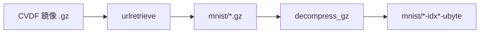

# mnist-playground

以 Python 逐步探索 MNIST 手寫數字資料集：下載原始資料、匯出 PNG 圖片。

## 環境需求

- Python 3.9 以上（需支援 `str.removesuffix`）
- [Miniconda](https://docs.anaconda.com/miniconda/)（建議）或已安裝的 Python 3

## 使用 Miniconda 建立環境

以下指令假設你已安裝 Miniconda，並在專案根目錄執行。

### 1. 建立並啟用 Conda 環境

```bash
conda create -n mnist-playground python=3.12 -y
conda activate mnist-playground
```

### 2. 安裝相依套件

```bash
pip install -r requirements.txt
```

### 3. 執行步驟腳本

依序執行各步驟（後續步驟依賴前一步產出的資料）：

```bash
# 步驟 1：下載並解壓 MNIST 原始檔至 mnist/
python step_1_download_mnist.py

# 步驟 2：將全部圖片匯出至 images/（依 train/test 與標籤分類）
python step_2_show_image.py
```

### 4. 離開環境（選用）

```bash
conda deactivate
```

## 專案結構說明

| 路徑 | 說明 |
|------|------|
| `mnist/` | MNIST IDX 原始檔（由 step 1 產生，已加入 `.gitignore`） |
| `images/` | 匯出的 PNG 圖片（由 step 2 產生，已加入 `.gitignore`） |
| `step_1_download_mnist.py` | 從官方鏡像下載並解壓資料集 |
| `step_2_show_image.py` | 解析 IDX 格式並輸出 PNG |

## 相依套件

| 套件 | 用途 |
|------|------|
| Pillow | 將 MNIST 像素資料寫入 PNG（僅 step 2 需要） |

`step_1_download_mnist.py` 僅使用 Python 標準函式庫，無需額外安裝套件。

## 程式碼說明

### step_1_download_mnist.py

從 [Google CVDF 鏡像](https://storage.googleapis.com/cvdf-datasets/mnist/) 下載 4 個 `.gz` 壓縮檔，解壓至 `mnist/` 目錄，供 step 2 讀取。

**下載清單**

| 壓縮檔 | 解壓後 | 內容 |
|--------|--------|------|
| `train-images-idx3-ubyte.gz` | `train-images-idx3-ubyte` | 訓練集圖像（60000 張） |
| `train-labels-idx1-ubyte.gz` | `train-labels-idx1-ubyte` | 訓練集標籤 |
| `t10k-images-idx3-ubyte.gz` | `t10k-images-idx3-ubyte` | 測試集圖像（10000 張） |
| `t10k-labels-idx1-ubyte.gz` | `t10k-labels-idx1-ubyte` | 測試集標籤 |

**執行流程**

1. `os.makedirs("mnist")` 建立輸出目錄
2. `urllib.request.urlretrieve` 下載至 `mnist/{file}`
3. `decompress_gz` 以 `gzip.open` 讀取、`shutil.copyfileobj` 寫出原始 IDX 二進位檔
4. 輸出路徑以 `removesuffix(".gz")` 去掉副檔名



僅使用 Python 標準函式庫（`gzip`、`os`、`shutil`、`urllib.request`），無需額外安裝套件。

### step_2_show_image.py

讀取 `mnist/` 下的 IDX 原始檔，將每張 28×28 灰階圖匯出為 PNG，依 `train`/`test` 分割與數字標籤（0–9）分類存放。

**整體流程**

1. 檢查 `mnist/` 下 4 個 IDX 檔是否存在，缺檔則提示先執行 step 1
2. 對 `train` / `test` 各呼叫 `export_split`：讀圖 + 讀標籤 → 逐張寫入 `images/{split}/{label}/{index:05d}.png`

#### 背景：MNIST IDX 格式

MNIST 原始資料不是 PNG，而是 Yann LeCun 定義的 **IDX 格式**：

| 檔案類型 | 後綴 | Magic Number | 維度 |
|---------|------|--------------|------|
| 圖像 | `idx3-ubyte` | **2051** | 3 維（張數 × 高 × 寬） |
| 標籤 | `idx1-ubyte` | **2049** | 1 維（筆數） |

檔案結構：**固定長度的檔頭（header）** + **連續的原始位元組（payload）**。

#### `read_images` 原理

```python
def read_images(path: str) -> tuple[bytes, int, int, int]:
    """讀取 IDX3 圖像檔，回傳像素位元組、張數、列數、行數。"""
    with open(path, "rb") as f:
        # 大端序：magic(2051)、張數、列數、行數
        magic, count, rows, cols = struct.unpack(">IIII", f.read(16))
        if magic != 2051:
            raise ValueError(f"unexpected magic number in {path}: {magic}")
        return f.read(count * rows * cols), count, rows, cols
```

**1. 以二進位模式開檔**

`"rb"` 表示不經文字解碼，直接讀原始位元組。

**2. 解析 16 位元組檔頭**

`struct.unpack(">IIII", f.read(16))` 把前 16 個位元組拆成 4 個 **32 位元無符號整數**：

| 欄位 | 位元組偏移 | 含義 |
|------|-----------|------|
| magic | 0–3 | 格式識別碼，圖像檔應為 **2051** |
| count | 4–7 | 圖片張數（訓練集 60000，測試集 10000） |
| rows | 8–11 | 每張圖高度（MNIST 為 **28**） |
| cols | 12–15 | 每張圖寬度（MNIST 為 **28**） |

- `>`：大端序（高位元組在前），符合 IDX 規範
- `I`：unsigned int，4 位元組
- 4 個 `I` → 共 16 位元組

**3. 驗證 magic number**

`2051` 代表「3 維 unsigned byte 資料集」，用來確認檔案類型正確。

**4. 一次讀入全部像素**

```python
f.read(count * rows * cols)
```

檔頭之後是 **連續排列** 的像素：每張 28×28 = 784 位元組，灰階值 0–255（0 黑、255 白）。

記憶體布局示意：

```
[圖0: 784 bytes][圖1: 784 bytes][圖2: 784 bytes]...
 ↑ i=0          ↑ i=1          ↑ i=2
```

回傳 `(pixels, count, rows, cols)`，後續用索引切片取第 i 張：

```python
img_bytes = pixels[i * pixel_size : (i + 1) * pixel_size]
```

#### `read_labels` 原理

```python
def read_labels(path: str) -> tuple[bytes, int]:
    """讀取 IDX1 標籤檔，回傳標籤位元組與筆數。"""
    with open(path, "rb") as f:
        # 大端序：magic(2049)、筆數
        magic, count = struct.unpack(">II", f.read(8))
        if magic != 2049:
            raise ValueError(f"unexpected magic number in {path}: {magic}")
        return f.read(count), count
```

**1. 8 位元組檔頭**

| 欄位 | 位元組偏移 | 含義 |
|------|-----------|------|
| magic | 0–3 | 標籤檔應為 **2049**（1 維 unsigned byte） |
| count | 4–7 | 標籤筆數，應與圖像張數相同 |

`">II"` → 2 個 unsigned int，共 8 位元組。

**2. 讀取標籤 payload**

`f.read(count)` 讀取 **count 個位元組**，每個位元組是一個數字標籤 **0–9**。

```
labels[0]=5, labels[1]=0, labels[2]=4, ...
```

Python 的 `bytes` 索引得到的是 **0–255 的 int**，對 MNIST 標籤即 0–9。

#### 兩者如何對應

在 `export_split` 裡：

```python
pixels, count, rows, cols = read_images(f"{MNIST_DIR}/{images_file}")
labels, label_count = read_labels(f"{MNIST_DIR}/{labels_file}")
if count != label_count:
    raise ValueError(
        f"mismatch in {split}: {count} images vs {label_count} labels"
    )

pixel_size = rows * cols
for i in range(count):
    label = labels[i]
```

同一索引 `i` 表示同一筆樣本：第 `i` 張圖的 784 位元組，對應第 `i` 個標籤位元組。MNIST 保證圖像檔與標籤檔 **順序一致**。

#### 檔案整體結構示意

```
train-images-idx3-ubyte
┌─────────────────────────────────────┐
│ Header (16 bytes)                   │
│  magic=2051 | count=60000           │
│  rows=28    | cols=28               │
├─────────────────────────────────────┤
│ Pixel data (60000 × 28 × 28 bytes)  │
│  [img0][img1][img2]...[img59999]    │
└─────────────────────────────────────┘

train-labels-idx1-ubyte
┌─────────────────────────────────────┐
│ Header (8 bytes)                    │
│  magic=2049 | count=60000           │
├─────────────────────────────────────┤
│ Label data (60000 bytes)            │
│  [5][0][4][1]...[9]  每個 0-9       │
└─────────────────────────────────────┘
```

#### `export_split` 與 PNG 輸出

- 比對圖像張數與標籤筆數，不一致則拋錯
- `Image.frombytes("L", (cols, rows), img_bytes)`：`"L"` 表示 8 位元灰階，將一維位元組還原為 28×28 影像
- 輸出目錄結構：`images/train/3/00042.png`（分割 / 標籤 / 原始索引）

`Image.frombytes("L", (cols, rows), img_bytes)` 會把 784 位元組的一維資料，依 `(cols, rows)` 即 `(28, 28)` 逐列填入，還原成灰階圖像後再存成 PNG。

#### 設計要點

1. **`struct.unpack`**：把二進位檔頭按固定格式解析成 Python 整數，避免手動移位。
2. **大端序 `>`**：與 IDX 規範一致；若用小端序會讀錯 magic 和維度。
3. **一次讀入 payload**：`f.read(n)` 簡單高效；60000×784 ≈ 47MB，可接受。
4. **回傳 `bytes` 而非逐張解析**：切片 `pixels[i*784:(i+1)*784]` 即可，延後交給 PIL 的 `Image.frombytes("L", (28, 28), ...)` 轉成 PNG。
