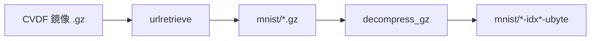

# mnist-playground

以 Python 逐步探索 MNIST 手寫數字資料集：下載原始資料、匯出 PNG 圖片。

## 環境需求

- Python 3.9 以上（需支援 `str.removesuffix`）
- [Miniconda](https://docs.anaconda.com/miniconda/)（建議）或已安裝的 Python 3

## 使用 Miniconda 建立環境

以下指令假設你已安裝 Miniconda，並在專案根目錄執行。

### 1. 建立並啟用 Conda 環境

```bash
conda create -n mnist-playground python=3.12 -y
conda activate mnist-playground
```

### 2. 安裝相依套件

```bash
pip install -r requirements.txt
```

### 3. 執行步驟腳本

依序執行各步驟（後續步驟依賴前一步產出的資料）：

```bash
# 步驟 1：下載並解壓 MNIST 原始檔至 mnist/
python step_1_download_mnist.py

# 步驟 2：將全部圖片匯出至 images/（依 train/test 與標籤分類）
python step_2_show_image.py
```

### 4. 離開環境（選用）

```bash
conda deactivate
```

## 專案結構說明

| 路徑 | 說明 |
|------|------|
| `mnist/` | MNIST IDX 原始檔（由 step 1 產生，已加入 `.gitignore`） |
| `images/` | 匯出的 PNG 圖片（由 step 2 產生，已加入 `.gitignore`） |
| `step_1_download_mnist.py` | 從官方鏡像下載並解壓資料集 |
| `step_2_show_image.py` | 解析 IDX 格式並輸出 PNG |

## 相依套件

| 套件 | 用途 |
|------|------|
| Pillow | 將 MNIST 像素資料寫入 PNG（僅 step 2 需要） |

`step_1_download_mnist.py` 僅使用 Python 標準函式庫，無需額外安裝套件。

## 程式碼說明

### step_1_download_mnist.py

從 [Google CVDF 鏡像](https://storage.googleapis.com/cvdf-datasets/mnist/) 下載 4 個 `.gz` 壓縮檔，解壓至 `mnist/` 目錄，供 step 2 讀取。

**下載清單**

| 壓縮檔 | 解壓後 | 內容 |
|--------|--------|------|
| `train-images-idx3-ubyte.gz` | `train-images-idx3-ubyte` | 訓練集圖像（60000 張） |
| `train-labels-idx1-ubyte.gz` | `train-labels-idx1-ubyte` | 訓練集標籤 |
| `t10k-images-idx3-ubyte.gz` | `t10k-images-idx3-ubyte` | 測試集圖像（10000 張） |
| `t10k-labels-idx1-ubyte.gz` | `t10k-labels-idx1-ubyte` | 測試集標籤 |

**執行流程**

1. `os.makedirs("mnist")` 建立輸出目錄
2. `urllib.request.urlretrieve` 下載至 `mnist/{file}`
3. `decompress_gz` 以 `gzip.open` 讀取、`shutil.copyfileobj` 寫出原始 IDX 二進位檔
4. 輸出路徑以 `removesuffix(".gz")` 去掉副檔名



僅使用 Python 標準函式庫（`gzip`、`os`、`shutil`、`urllib.request`），無需額外安裝套件。

### step_2_show_image.py

讀取 `mnist/` 下的 IDX 原始檔，將每張 28×28 灰階圖匯出為 PNG，依 `train`/`test` 分割與數字標籤（0–9）分類存放。

**整體流程**

1. 檢查 `mnist/` 下 4 個 IDX 檔是否存在，缺檔則提示先執行 step 1
2. 對 `train` / `test` 各呼叫 `export_split`：讀圖 + 讀標籤 → 逐張寫入 `images/{split}/{label}/{index:05d}.png`

**MNIST IDX 格式**

MNIST 原始資料為 **固定檔頭 + 連續 payload** 的二進位格式：

| 類型 | 後綴 | Magic Number | 維度 |
|------|------|--------------|------|
| 圖像 | `idx3-ubyte` | 2051 | 張數 × 28 × 28 |
| 標籤 | `idx1-ubyte` | 2049 | 筆數（每筆 1 byte，值 0–9） |

**`read_images`**

讀取 IDX3 圖像檔，回傳像素位元組、張數、列數、行數：

```python
magic, count, rows, cols = struct.unpack(">IIII", f.read(16))
```

- 以 `"rb"` 開檔，用 `struct.unpack(">IIII", ...)` 解析 **大端序** 16 位元組檔頭：magic、count、rows、cols
- 驗證 `magic == 2051`
- 一次讀入 `count * rows * cols` 位元組作為所有像素；每張圖 784 bytes，依序排列
- 回傳 `(pixels, count, rows, cols)`，後續以 `pixels[i * 784 : (i + 1) * 784]` 切片取第 i 張

**`read_labels`**

讀取 IDX1 標籤檔，回傳標籤位元組與筆數：

```python
magic, count = struct.unpack(">II", f.read(8))
```

- `struct.unpack(">II", ...)` 解析 8 位元組檔頭：magic、count
- 驗證 `magic == 2049`
- 讀取 `count` 個位元組，每 byte 為一個數字標籤（0–9）
- 回傳 `(labels, count)`；`labels[i]` 與第 i 張圖一一對應

**`export_split` 與 PNG 輸出**

- 比對圖像張數與標籤筆數，不一致則拋錯
- `Image.frombytes("L", (cols, rows), img_bytes)`：`"L"` 表示 8 位元灰階，將一維位元組還原為 28×28 影像
- 輸出目錄結構：`images/train/3/00042.png`（分割 / 標籤 / 原始索引）

檔案結構示意：

```
train-images-idx3-ubyte
[Header 16B: magic|count|rows|cols][Pixel data: img0|img1|...]

train-labels-idx1-ubyte
[Header 8B: magic|count][Label data: byte0|byte1|...]
```
